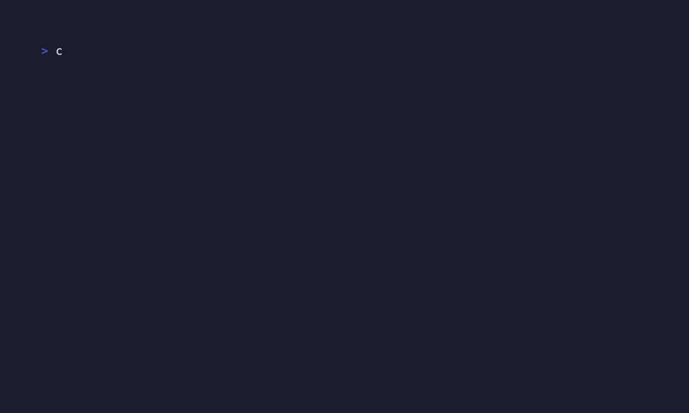
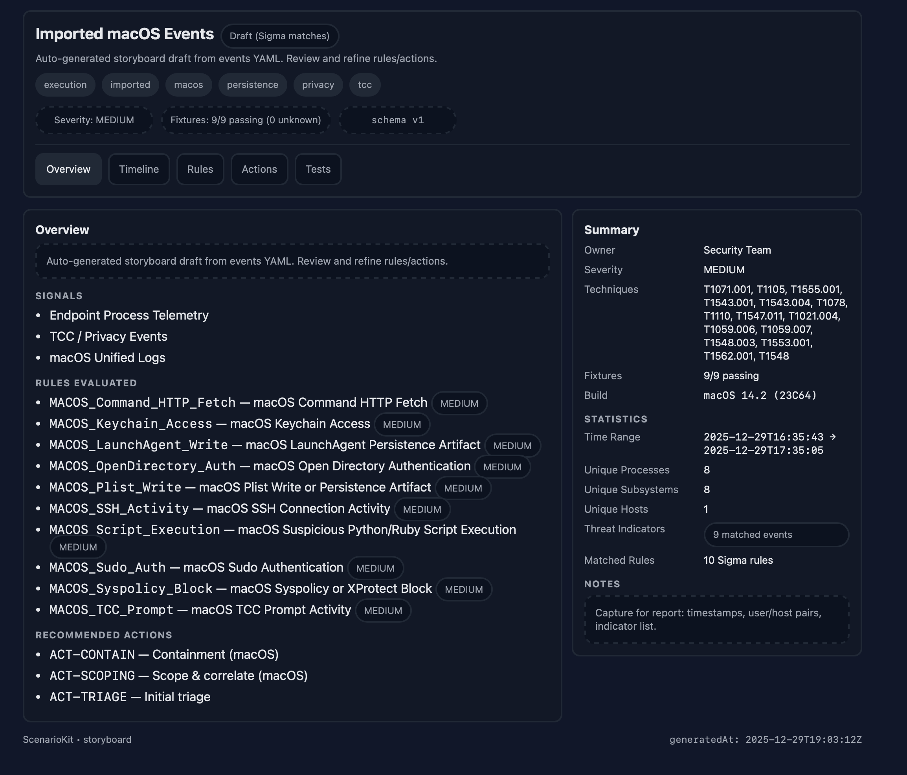

# ScenarioKit

**ScenarioKit** is a Swift-based CLI tool for generating rich, offline security storyboards from macOS Unified Logs. Transform raw logs into beautiful HTML reports with automated rule matching (Sigma), timeline visualization, and actionable intelligence - all running locally with zero external dependencies.

## Demo


## Output Example


## Features

- 🎯 **20 Sigma Rules**: Comprehensive macOS detection rules covering persistence, privilege escalation, lateral movement, credential access, defense evasion, and more
- 📊 **Auto Statistics**: Unique processes, subsystems, hosts, time ranges, and threat indicators
- 🎨 **Beautiful HTML**: Single-file, offline reports with dark/light themes
- 🔍 **Smart Filtering**: Automatic noise reduction keeps only security-relevant events
- 🏷️ **MITRE ATT&CK**: Techniques automatically extracted from Sigma rule tags (30+ techniques covered)
- 🖥️ **Sysdiagnose Support**: Built-in helper for offline logarchive analysis
- ✅ **Complete Examples**: Demo files with all fields populated for immediate testing

## Requirements

- macOS with Swift 6 (Xcode 15.3 or later)
- `jq` for log processing (`brew install jq`)
- No external services; everything runs locally

## Installation

### Homebrew (Recommended)

```sh
brew install texasbe2trill/tap/scenariokit
```

Verify installation:
```sh
scenariokit --version
scenariokit --help
```

### Build from Source

```sh
git clone https://github.com/texasbe2trill/ScenarioKit.git
cd ScenarioKit
swift build
```

Run with:
```sh
swift run scenariokit --version
```

## Quick Start: Live Logs → Storyboard

### Capture Security Events

The following command captures relevant security signals from macOS Unified Logs. This includes HTTP fetches, TCC prompts, LaunchAgent activity, DNS queries, and system policy events:

```sh
log show --last 20m --style json \
  --predicate '
    (process CONTAINS[c] "curl" OR process CONTAINS[c] "wget" OR eventMessage CONTAINS[c] "http") OR
    (eventMessage CONTAINS[c] ".plist" OR eventMessage CONTAINS[c] "launchagent" OR eventMessage CONTAINS[c] "launchdaemon") OR
    (subsystem CONTAINS[c] "dns" OR category CONTAINS[c] "dns") OR
    (subsystem CONTAINS[c] "tcc" OR eventMessage CONTAINS[c] "tcc") OR
    (eventMessage CONTAINS[c] "syspolicyd" OR eventMessage CONTAINS[c] "gatekeeper" OR eventMessage CONTAINS[c] "xprotect" OR eventMessage CONTAINS[c] "quarantine")
  ' \
| jq '[.[] | {
  timestamp,
  process,
  processID,
  processImagePath: .imagePath,
  subsystem,
  category,
  eventMessage,
  composedMessage,
  senderImagePath,
  senderImageUUID,
  traceID,
  bootUUID,
  machTimestamp,
  hostName,
  osVersion
}]' > macos_signals.json
```

**Note**: The `hostName` and `osVersion` fields populate **Build** and **Unique Hosts** in the storyboard summary. If these are empty in your output, ensure your log show command includes them (they may not be available in all log types).

### Generate the Storyboard

```sh
# If installed via Homebrew:
scenariokit storyboard import-events macos_signals.json --open

# If built from source:
swift run scenariokit storyboard import-events macos_signals.json --open
```

This command:
- ✅ Matches events against built-in Sigma rules
- ✅ Extracts MITRE ATT&CK techniques from matched rules
- ✅ Generates statistics (unique processes, hosts, time ranges)
- ✅ Creates a single-file HTML report with timeline and fixtures
- ✅ Opens the report in your default browser (with `--open`)

**Example Output:**

```
▸ Loading events...
▸ Building storyboard draft...
ℹ️  storyboard import: filtered 3 noisy events (kept 11 of 14).
ℹ️  sigma: kept 9 of 11 events that matched Sigma macOS rules.
▸ Rendering HTML...
✔ Wrote storyboard to storyboard.html
```

**Generated Storyboard Summary:**
- **Owner**: Security Team (default for import-events) or custom from curated YAML
- **Build**: macOS 14.2 (23C64)
- **Severity**: MEDIUM
- **Techniques**: T1071.001, T1105, T1548, T1562.001, T1543.001, T1021.004, T1555.001, and more
- **Fixtures**: 9/9 passing (import-events) or 4/4 passing (curated)
- **Statistics**: 
  - Time Range: 2025-12-29T16:35:43 → 2025-12-29T17:35:05
  - Unique Processes: 8 (Terminal, curl, bash, launchd, sshd, security, etc.)
  - Unique Subsystems: 8
  - Unique Hosts: 1
  - Matched Rules: 10 Sigma rules (import-events detects live matches)
  - Threat Indicators: 9 matched events

### Setting the Owner Field

The **Owner** field identifies who is responsible for the security scenario (e.g., your team name, analyst name, or organization).

**For import-events (auto-generated storyboards):**
- Default owner is set to "Security Team"
- To customize, create a curated YAML storyboard (see Option 1 below)

**Option 1: Create a curated storyboard YAML** (Recommended for reviewed scenarios)

```yaml
version: 1
build: "production-macos"

scenario:
  name: "Suspicious HTTP Activity - Dec 2025"
  description: "Investigation of curl/wget HTTP fetches observed on user endpoints"
  owner: "Your Team Name"  # ← Set your custom owner here
  tags: ["macos", "http", "investigation"]

severity: medium

# ... (rest of your storyboard)
```

Then render it:
```sh
# Homebrew:
scenariokit storyboard render my_storyboard.yaml --open

# Source:
swift run scenariokit storyboard render my_storyboard.yaml --open
```

**Option 2: Modify the default in code** (For permanent custom default)

Edit [Sources/ScenarioKit/Core/EventImport.swift](Sources/ScenarioKit/Core/EventImport.swift) line 147:
```swift
owner: "Your Organization Name",  // Change from "Security Team"
```

## Advanced Usage

### High-Signal TCC Events

Capture Transparency, Consent, and Control (TCC) events for privacy/permission analysis:

```sh
log show --last 60m --style json --predicate 'subsystem == "com.apple.TCC"' \
| jq '[.[] | {
  timestamp,
  process,
  processID,
  processImagePath: .imagePath,
  subsystem,
  category,
  eventMessage,
  composedMessage,
  messageType,
  senderImagePath,
  senderImageUUID,
  threadID,
  activityIdentifier,
  machTimestamp,
  traceID,
  bootUUID,
  timezoneName,
  hostName,
  osVersion
}]' \
> tcc_events.json

# Homebrew:
scenariokit storyboard import-events tcc_events.json --open

# Source:
swift run scenariokit storyboard import-events tcc_events.json --open
```

**Note**: If no Sigma rules match, the HTML will be sparse. TCC events may be filtered as background noise unless they match specific patterns.

### Sysdiagnose Analysis (Offline)

For richer coverage using sysdiagnose archives:

```sh
# Generate sysdiagnose: Press ⌃⌥⌘⇧. or run:
sudo sysdiagnose -f /tmp

# Extract events from the logarchive (Homebrew):
scenariokit sysdiagnose-dump \
  "/private/tmp/sysdiagnose_*/system_logs.logarchive" \
  --out macos_sysdiag_events.json \
  --minutes 180

# Validate and generate storyboard:
scenariokit validate events macos_sysdiag_events.json
scenariokit storyboard import-events macos_sysdiag_events.json --open

# If using source, prefix all commands with: swift run
```

Options for `sysdiagnose-dump`:
- `--minutes N`: Adjust time window (default: 180)
- `--include-debug`: Include info/debug messages (slower, larger output)
- `--predicate '...'`: Override security predicate with custom filter
- `--raw`: Emit NDJSON as-is (no JSON array wrapping)

### Curated Storyboards

For reviewed, shareable scenarios:

```sh
# Homebrew:
scenariokit storyboard render examples/storyboard_macos_example.yaml --open

# Source:
swift run scenariokit storyboard render examples/storyboard_macos_example.yaml --open
```

## CLI Reference

> **Note**: Examples below use `scenariokit` (Homebrew). If building from source, prefix all commands with `swift run`.

### Render Storyboard

Generate HTML from a curated storyboard YAML/JSON:

```sh
scenariokit storyboard render <path> [options]
```

**Arguments:**
- `<path>`: Storyboard YAML or JSON file (required)

**Options:**
- `--out <file>`: Output HTML path (default: `storyboard.html`)
- `--theme light|dark`: Theme (default: `dark`)
- `--max-events <N>`: Cap embedded fixtures (default: `200`)
- `--open`: Open the generated HTML in your default browser

**Example:**
```sh
scenariokit storyboard render my_scenario.yaml --out report.html --theme light --open
```

---

### Import Events

Generate a storyboard draft from raw event logs (applies Sigma matching):

```sh
scenariokit storyboard import-events <path> [options]
```

**Arguments:**
- `<path>`: Events YAML/JSON (top-level array or `events`/`items` array) (required)

**Options:**
- `--name <string>`: Override scenario name
- `--out <file>`: Output HTML path (default: `storyboard.html`)
- `--theme light|dark`: Theme (default: `dark`)
- `--max-events <N>`: Cap embedded fixtures (default: `200`)
- `--open`: Open the generated HTML in your default browser

**Example:**
```sh
scenariokit storyboard import-events events.json --name "HTTP Investigation" --open
```

**How it works:**
1. Loads events from JSON/YAML
2. Applies noise filtering (drops chatty macOS subsystems)
3. Matches events against built-in Sigma rules
4. Extracts MITRE ATT&CK techniques from matched rules
5. Generates statistics (processes, hosts, time ranges)
6. Creates single-file HTML with timeline and fixtures

**Only Sigma-matched events are kept.** If nothing matches, the output will be sparse.

---

### Validate Storyboard

Check if a storyboard YAML/JSON is valid:

```sh
scenariokit validate storyboard <path>
```

---

### Validate Events

Check if events JSON/YAML can be parsed and imported:

```sh
scenariokit validate events <path>
```

---

### Sysdiagnose Dump

Extract security-relevant events from a sysdiagnose logarchive:

```sh
scenariokit sysdiagnose-dump <logarchive-or-dir> [options]
```

**Arguments:**
- `<logarchive-or-dir>`: Path to `.logarchive` or sysdiagnose directory (required)

**Options:**
- `--out <file>`: Output JSON path (default: prints to stdout)
- `--minutes <N>`: Time window in minutes (default: `180`)
- `--predicate '...'`: Custom predicate (overrides default security filter)
- `--include-debug`: Include info/debug messages (slower, larger output)
- `--raw`: Emit NDJSON as-is (no JSON array wrapping)

**Example:**
```sh
scenariokit sysdiagnose-dump \
  /tmp/sysdiagnose_2025.12.29_*/system_logs.logarchive \
  --out events.json \
  --minutes 60
```

## Understanding Storyboard Fields

When you generate a storyboard, the **Summary** section displays key metadata. Here's what each field means and how to populate it:

| Field | Description | How to Populate |
|-------|-------------|-----------------|
| **Owner** | Team/analyst responsible for the scenario | Manual: Set `scenario.owner` in your YAML or extracted JSON |
| **Severity** | Risk level (low, medium, high, critical) | Auto-extracted from matched Sigma rules (highest severity wins) |
| **Techniques** | MITRE ATT&CK technique IDs | Auto-extracted from Sigma rule `tags` (e.g., `T1071.001`) |
| **Fixtures** | Number of matching events | Auto-counted from Sigma-matched events |
| **Build** | macOS version/build | Add `osVersion` field to your jq query (see examples above) |

**Statistics Section:**

| Statistic | Description | How to Populate |
|-----------|-------------|-----------------|
| **Time Range** | First → Last event timestamp | Auto-computed from `timestamp` field |
| **Unique Processes** | Distinct processes observed | Auto-extracted from `process`, `processImagePath`, or `senderImagePath` |
| **Unique Subsystems** | Distinct macOS subsystems | Auto-extracted from `subsystem` field |
| **Unique Hosts** | Distinct hosts/machines | Add `hostName` field to your jq query (see examples above) |
| **Threat Indicators** | Total matched events | Auto-counted from Sigma matches |
| **Matched Rules** | Number of Sigma rules triggered | Auto-counted from active Sigma rules |

### Troubleshooting Empty Fields

**Problem: "Build: —" and "Unique Hosts: 0"**

**Solution**: macOS Unified Logs may not include `osVersion` or `hostName` by default. Update your jq query:

```sh
log show --last 20m --style json --predicate '...' \
| jq '[.[] | {
  timestamp,
  process,
  subsystem,
  eventMessage,
  hostName,      # ← Add this for Unique Hosts
  osVersion,     # ← Add this for Build
  # ... other fields
}]' > events.json
```

If `hostName` is still empty, you can use `bootUUID` as a host identifier (each boot session is unique). Alternatively, add hostname tracking if collecting logs from multiple Macs.

**Problem: "Owner: —"**

**Solution**: The Owner field is **not extracted from logs**. You must set it manually:

1. Create a YAML storyboard with `scenario.owner: "Your Team"`
2. Or extract the JSON from auto-generated HTML and add the owner field before re-rendering

See the [Setting the Owner Field](#setting-the-owner-field) section above for detailed instructions.
 
## How It Works

1. **Event Collection**: Use `log show` with predicates to capture security-relevant macOS Unified Logs
2. **Sigma Matching**: Events are matched against built-in Sigma rules (HTTP fetches, TCC, LaunchAgents, DNS, etc.)
3. **Noise Filtering**: Chatty macOS background subsystems are automatically filtered out
4. **MITRE Mapping**: Techniques are extracted from Sigma rule tags (e.g., `attack.t1071.001` → `T1071.001`)
5. **Statistics**: Unique processes, subsystems, hosts, and time ranges are computed
6. **HTML Generation**: Single-file report with embedded timeline, fixtures, and rules

**Only Sigma-matched events are kept** in the final storyboard. If no rules match, the output will be sparse.

## Bundled Sigma Rules

ScenarioKit includes **20 comprehensive macOS-specific Sigma rules** covering the full MITRE ATT&CK framework:

| Rule | Detects | MITRE Techniques |
|------|---------|------------------|
| **HTTP Fetch** | curl/wget with URL indicators | `T1071.001`, `T1105` |
| **TCC Prompt** | Privacy permission prompts | `T1548`, `T1562.001` |
| **LaunchAgent** | LaunchAgent/Daemon creation | `T1543.001`, `T1543.004` |
| **DNS Activity** | DNS lookups | `T1018`, `T1071.004` |
| **Plist Modification** | Plist file changes | `T1547.011`, `T1543.001` |
| **System Policy** | Gatekeeper/XProtect/Quarantine | `T1553.001`, `T1562.001` |
| **Sudo Authentication** | Privilege escalation via sudo | `T1548.003` |
| **SSH Activity** | SSH client/server connections | `T1021.004`, `T1071.001` |
| **Screensharing** | VNC/screensharing access | `T1021.005`, `T1113` |
| **Kernel Extension** | Kext loading | `T1547.006`, `T1543` |
| **FSEvents Monitor** | File system event monitoring | `T1119`, `T1083` |
| **OpenDirectory Auth** | Authentication events | `T1110`, `T1078` |
| **Keychain Access** | Credential theft attempts | `T1555.001` |
| **System Profiler** | System discovery | `T1082` |
| **Process Injection** | task_for_pid, mach ports | `T1055`, `T1055.002` |
| **Script Execution** | Python/Ruby/Perl/osascript | `T1059.006`, `T1059.007` |
| **Code Signing** | Signature verification failures | `T1553`, `T1553.002` |
| **WiFi Scanning** | Network discovery | `T1016`, `T1040` |
| **Time Machine** | Backup modifications | `T1070.004`, `T1490` |
| **Spotlight** | Index manipulation | `T1070`, `T1564.001` |

These rules automatically tag matched events with MITRE ATT&CK techniques.

## Examples

**Ready-to-use demo files with complete data (all fields populated):**
- **Curated storyboard**: [examples/storyboard_macos_example.yaml](examples/storyboard_macos_example.yaml) - Complete scenario with owner, build, rules with MITRE techniques, and 4 passing fixtures
- **Event imports (YAML)**: [examples/macos_events_example.yaml](examples/macos_events_example.yaml) - 14 realistic events covering 10 Sigma rules
- **Event imports (JSON)**: [examples/macos_events_example.json](examples/macos_events_example.json) - Same events in JSON format

**Curated storyboard features:**
- ✅ 4 rules with MITRE ATT&CK techniques (T1071.001, T1105, T1548, T1555.001, T1059.006, T1562.001)
- ✅ 4 fixtures with expected rule matches (all passing)
- ✅ Complete owner, build, and metadata
- ✅ Statistics: 4 threat indicators, 4 matched rules
- ✅ Ready for professional presentations and reports

**Import-events features:**
- ✅ Complete hostName and osVersion fields for statistics
- ✅ Multiple MITRE ATT&CK techniques across the kill chain
- ✅ Realistic process paths, subsystems, and event messages
- ✅ Timestamps covering ~1 hour time range
- ✅ Automatic Sigma rule matching (10 rules matched, 9 threat indicators)

**Quick demo:**
```sh
# Generate a complete storyboard from events (9/9 fixtures passing, 10 matched rules)
scenariokit storyboard import-events examples/macos_events_example.yaml --open

# Or render the curated storyboard (4/4 fixtures passing, 4 matched rules)
scenariokit storyboard render examples/storyboard_macos_example.yaml --open

# If built from source, prefix with: swift run
```

## Output Philosophy

- **Single-file HTML**: Inline CSS/JS, offline, Safari-friendly
- **Deterministic**: Repeatable runs produce identical output
- **No external dependencies**: No network fetches or external services
- **Build artifacts**: Generated HTML files (e.g., `storyboard.html`) are not meant for version control

> **Note**: Do not commit generated storyboard HTML files. Add `*.storyboard.html` and `storyboard.html` to your `.gitignore`.

## Development

```sh
# Build the project
swift build

# Run tests
swift test

# Run with debug output
swift run scenariokit storyboard import-events events.json --open
```

## Quick Troubleshooting

### ❌ `log show` Returns 0 Events

**Cause**: Terminal doesn't have Full Disk Access permission to read system logs

**Fix**: Grant Full Disk Access to your terminal app:
1. **System Settings** → **Privacy & Security** → **Full Disk Access**
2. Click **+** and add your Terminal app (Terminal.app, iTerm2, Warp, etc.)
3. Toggle it **ON**
4. **Restart your terminal** completely (quit and reopen)
5. Try `log show` again

**Alternative**: Use `sudo`:
```sh
sudo log show --last 60m --style json --predicate 'subsystem == "com.apple.TCC"' | jq '...'
```

This is especially common for privacy-sensitive logs like TCC, kernel, and security events. Without Full Disk Access, `log show` silently returns empty results.

---

### ❌ Empty Summary Fields (Build: —, Unique Hosts: 0)

**Cause**: Missing `hostName` or `osVersion` in your jq query

**Fix**: Update your jq command to include these fields:
```sh
| jq '[.[] | {
  timestamp,
  process,
  subsystem,
  eventMessage,
  hostName,     # ← Add for Unique Hosts
  osVersion,    # ← Add for Build
  # ... rest of fields
}]'
```

### ❌ "Owner: —" Empty

**Cause**: Using an older version without the default owner OR curated storyboard missing the owner field

**Fix**: 
- **Import-events**: Update to latest version (owner defaults to "Security Team")
- **Curated storyboards**: Add `owner` field to your YAML:
  ```yaml
  scenario:
    owner: "Your Team Name"  # ← Add this line
  ```

### ❌ Sparse/Empty Storyboard

**Cause**: No events matched Sigma rules

**Fix**: 
1. Verify your predicate captures relevant events (curl, TCC, LaunchAgents, etc.)
2. Check that events have `process`, `subsystem`, or `eventMessage` fields
3. Use a broader time window (`--last 60m` instead of `--last 10m`)
4. Validate events: `scenariokit validate events your_events.json`

### ❌ "0 matched events"

**Cause**: Events don't match Sigma rule patterns

**Fix**: Review bundled Sigma rules in [Sources/ScenarioKit/Resources/Sigma/macos/sigma-macos-rules.yml](Sources/ScenarioKit/Resources/Sigma/macos/sigma-macos-rules.yml) and ensure your predicate captures the expected event types.

## Acknowledgments

**Sigma Detection Rules**

This project includes detection rules sourced from the [SigmaHQ repository](https://github.com/SigmaHQ/sigma), which provides a generic and open signature format for SIEM systems. These rules have been adapted for macOS security event detection.

We acknowledge and thank the Sigma project and its contributors for establishing this open standard that makes threat detection accessible and shareable across the security community.

## License

See [LICENSE](LICENSE) for details.

## Contributing

Contributions are welcome! Please:
- Ensure all tests pass (`swift test`)
- Follow Swift conventions and existing code style
- Add tests for new features
- Update documentation as needed

---

**Made with ❤️ for macOS security practitioners**
